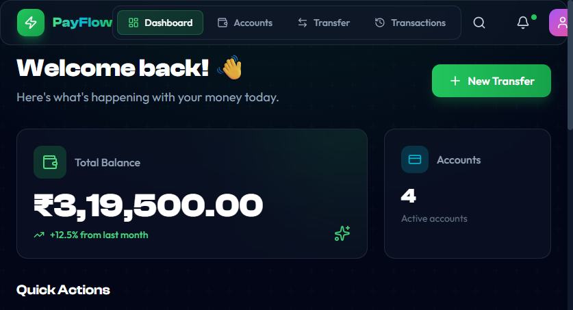

# 💰 PayFlow - Digital Wallet & Payment Platform

[](https://github.com/saurabh3108/payflow/actions/workflows/ci-cd.yml)
[](https://opensource.org/licenses/MIT)

> Real-time Digital Wallet and Payment Platform built with Microservices Architecture, Kubernetes, and Event-Driven Design

## 🎬 Demo



**Live URL (Local):** `http://localhost:8000`

## 🏗️ Architecture

```
┌─────────────────────────────────────────────────────────────────────────────┐
│                         KUBERNETES CLUSTER                                   │
│  ┌────────────────────────────────────────────────────────────────────────┐ │
│  │                         payflow namespace                               │ │
│  │                                                                         │ │
│  │   ┌─────────────────┐     ┌─────────────────────────────────────────┐  │ │
│  │   │   Frontend      │     │           BACKEND SERVICES              │  │ │
│  │   │   (React+Nginx) │     │                                         │  │ │
│  │   │      :80        │     │  ┌─────────┐ ┌─────────┐ ┌─────────┐  │  │ │
│  │   │                 │     │  │ Account │ │   Txn   │ │ Notify  │  │  │ │
│  │   │  ┌───────────┐  │     │  │ Service │ │ Service │ │ Service │  │  │ │
│  │   │  │  Nginx    │──┼─────┼─►│  :8081  │ │  :8082  │ │  :8083  │  │  │ │
│  │   │  │  Proxy    │  │     │  └─────────┘ └─────────┘ └─────────┘  │  │ │
│  │   │  │  /api/*   │  │     │        ▲           ▲           ▲      │  │ │
│  │   │  └───────────┘  │     │        └───────────┼───────────┘      │  │ │
│  │   └─────────────────┘     │                    │                  │  │ │
│  │           │               │  ┌─────────────────┴───────────────┐  │  │ │
│  │           │               │  │         API GATEWAY             │  │  │ │
│  │           └───────────────┼─►│           :8080                 │  │  │ │
│  │                           │  └─────────────────────────────────┘  │  │ │
│  │                           └───────────────────────────────────────┘  │ │
│  │                                           │                           │ │
│  │                         ┌─────────────────┴─────────────────┐        │ │
│  │                         │            KAFKA                   │        │ │
│  │                         │    (Event-Driven Messaging)        │        │ │
│  │                         └─────────────────┬─────────────────┘        │ │
│  │                                           │                           │ │
│  │                         ┌─────────────────┴─────────────────┐        │ │
│  │                         │          POSTGRESQL               │        │ │
│  │                         │          (Database)               │        │ │
│  │                         └───────────────────────────────────┘        │ │
│  │                                                                       │ │
│  └───────────────────────────────────────────────────────────────────────┘ │
└─────────────────────────────────────────────────────────────────────────────┘
```

## 🛠️ Technology Stack

| Layer | Technology |
|-------|------------|
| **Backend** | Java 21, Spring Boot 3.2, Spring Cloud Gateway |
| **Database** | PostgreSQL 15 |
| **Messaging** | Apache Kafka 3.7 (KRaft mode) |
| **Frontend** | React 18, Vite, Tailwind CSS, Framer Motion |
| **Web Server** | Nginx (Reverse Proxy for API) |
| **Container** | Docker |
| **Orchestration** | Kubernetes (Docker Desktop / K3s) |
| **CI/CD** | GitHub Actions with selective builds |
| **Registry** | GitHub Container Registry (GHCR) |
| **Monitoring** | Prometheus, Grafana *(coming soon)* |

## 📁 Project Structure

```
payflow/
├── services/
│   ├── api-gateway/          # Spring Cloud Gateway (Port 8080)
│   ├── account-service/      # Account Management (Port 8081)
│   ├── transaction-service/  # Transaction Processing (Port 8082)
│   └── notification-service/ # Kafka Event Consumer (Port 8083)
├── frontend/                 # React + Vite + Tailwind
│   ├── src/
│   │   ├── pages/           # Dashboard, Accounts, Transfer, Transactions
│   │   ├── components/      # Reusable UI components
│   │   └── api/             # API client configuration
│   ├── nginx.conf           # Nginx config with API proxy rules
│   └── Dockerfile           # Multi-stage build with Nginx
├── k8s/                      # Kubernetes Manifests
│   ├── namespace.yaml
│   ├── deployments/         # All service deployments
│   ├── services/            # ClusterIP services
│   ├── configmaps/          # Configuration
│   └── secrets/             # Sensitive data
├── .github/workflows/       # CI/CD Pipeline
│   └── ci-cd.yml            # Selective build & deploy
├── docs/images/             # Screenshots and documentation images
└── deploy-k8s.ps1           # Local deployment script
```

## 🔀 Nginx Reverse Proxy

One of the key architectural decisions in this project is using **Nginx as a reverse proxy** inside the frontend container. This solves a critical problem in Kubernetes: **how does a browser-based React app communicate with backend services?**

### The Problem

In Kubernetes, services communicate using internal DNS names (e.g., `api-gateway:8080`). But React apps run in the **browser**, not inside the cluster - so they can't resolve these internal service names.

### The Solution: Nginx Proxy

The frontend container runs Nginx which:
1. **Serves the React static files** (HTML, JS, CSS)
2. **Proxies API requests** to backend services

```nginx
# frontend/nginx.conf
server {
    listen 80;
    
    # API requests → proxy to API Gateway (internal K8s service)
    location /api/ {
        proxy_pass http://api-gateway:8080/api/;
        proxy_http_version 1.1;
        proxy_set_header Host $host;
        proxy_set_header X-Real-IP $remote_addr;
        proxy_set_header X-Forwarded-For $proxy_add_x_forwarded_for;
    }
    
    # All other requests → serve React app
    location / {
        root /usr/share/nginx/html;
        try_files $uri $uri/ /index.html;  # SPA routing
    }
}
```

### How It Works

```
Browser (localhost:8000)
    │
    ├── GET /dashboard → Nginx serves React app (index.html)
    │
    └── GET /api/accounts → Nginx proxies to api-gateway:8080
                                     │
                                     └── API Gateway routes to account-service:8081
```

### Benefits

| Benefit | Description |
|---------|-------------|
| **Single Entry Point** | Browser only needs to know one URL |
| **No CORS Issues** | Same-origin requests (API on same domain) |
| **Security** | Backend services never exposed directly |
| **K8s Native** | Uses internal service discovery |

## 🚀 Quick Start

### Prerequisites

- Docker Desktop with Kubernetes enabled
- Java 21
- Maven 3.8+
- Node.js 20+
- kubectl

### Option 1: Local Kubernetes (Recommended)

```powershell
# Clone the repository
git clone https://github.com/saurabh3108/payflow.git
cd payflow

# Deploy to Kubernetes
./deploy-k8s.ps1 -Environment dev

# Access the application
kubectl port-forward svc/frontend 8000:80 -n payflow

# Open http://localhost:8000
```

### Option 2: Docker Compose

```bash
docker-compose up -d
# Open http://localhost:3000
```

## 🔄 CI/CD Pipeline

Our pipeline features **selective builds** - only changed services are built and deployed:

```
┌──────────────┐   ┌──────────────┐   ┌──────────────┐   ┌──────────────┐
│   DETECT     │──►│    BUILD     │──►│    PUSH      │──►│   DEPLOY     │
│   CHANGES    │   │ (only changed)│   │  to GHCR    │   │  Summary     │
└──────────────┘   └──────────────┘   └──────────────┘   └──────────────┘
```

| Branch | Image Tag | Action |
|--------|-----------|--------|
| `develop` | `:develop` | Build → Push → Show deploy commands |
| `main` | `:latest` | Build → Push → Show deploy commands |

### After Push:

The pipeline summary shows exact commands to run:

```powershell
# Restart updated services
kubectl rollout restart deployment/frontend -n payflow
kubectl rollout restart deployment/account-service -n payflow

# Verify
kubectl get pods -n payflow
```

## 📨 API Endpoints

All API requests go through `http://localhost:8000/api/` (proxied by Nginx)

### Account Service

| Method | Endpoint | Description |
|--------|----------|-------------|
| POST | `/api/accounts` | Create account |
| GET | `/api/accounts` | List all accounts |
| GET | `/api/accounts/{id}` | Get account by ID |
| GET | `/api/accounts/number/{num}` | Get by account number |

### Transaction Service

| Method | Endpoint | Description |
|--------|----------|-------------|
| POST | `/api/transactions` | Initiate transfer |
| GET | `/api/transactions` | List all transactions |
| GET | `/api/transactions/{id}` | Get transaction by ID |
| GET | `/api/transactions/account/{num}` | Get by account number |

## 🔧 Key Features

- ✅ **Microservices Architecture** - 5 independent services
- ✅ **Event-Driven** - Kafka for async communication
- ✅ **Nginx Reverse Proxy** - Clean API routing from frontend
- ✅ **Kubernetes Native** - Full k8s deployment manifests
- ✅ **Selective CI/CD** - Only builds changed services
- ✅ **Modern React UI** - Tailwind CSS, Framer Motion animations
- ✅ **API Gateway** - Spring Cloud Gateway routing
- ✅ **Health Checks** - Kubernetes probes configured
- ✅ **GitOps Ready** - GHCR images, k8s manifests

## 🖥️ Local Development

### Quick Restart (After Pipeline Push)

```powershell
# Pull latest changes
git pull origin develop

# Restart only changed services
./deploy-k8s.ps1 -RolloutOnly
```

### Full Redeploy

```powershell
./deploy-k8s.ps1 -Environment dev
```

### Skip Infrastructure

```powershell
./deploy-k8s.ps1 -Environment dev -SkipInfra
```

## 📊 Upcoming Features

- [ ] Prometheus metrics collection
- [ ] Grafana dashboards
- [ ] User authentication (JWT)
- [ ] Transaction notifications
- [ ] QR code payments
- [ ] AWS Production deployment

## 👥 Author

**Saurabh Kumar** - [GitHub](https://github.com/saurabh3108)

## 📄 License

This project is licensed under the MIT License - see the [LICENSE](LICENSE) file for details.

---

*Built with ❤️ using Spring Boot, React, Kubernetes, Kafka, and Nginx*
